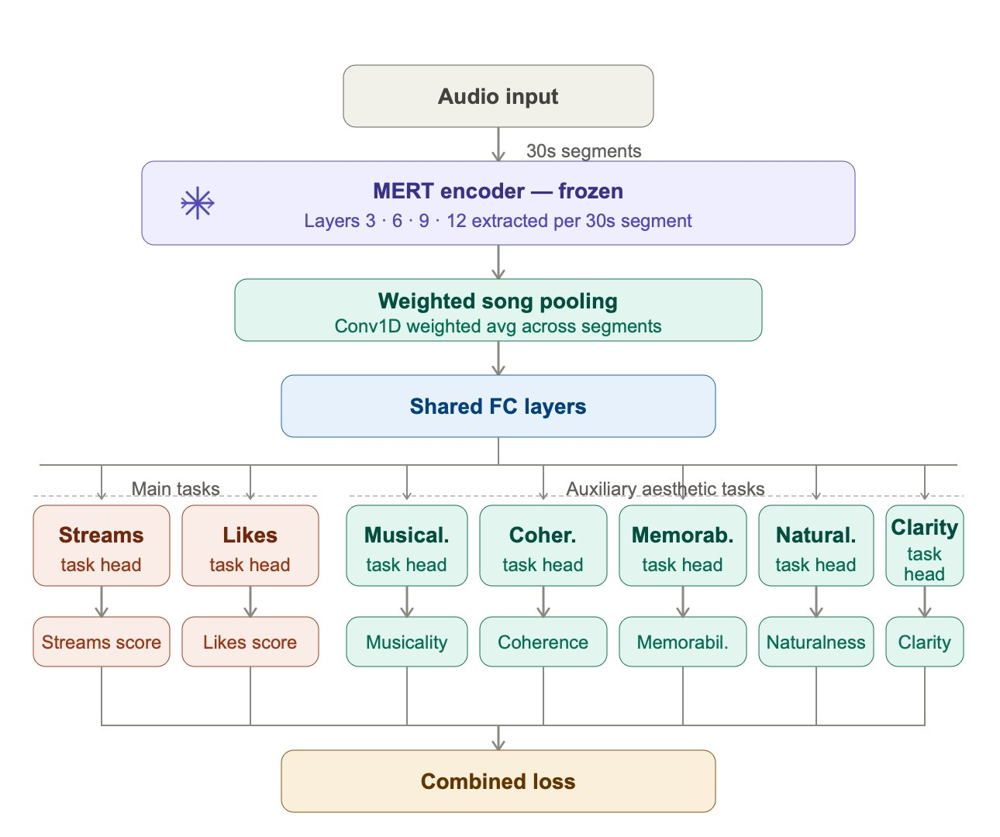

# APEX: Large-Scale Multi-Task Aesthetic-Informed Popularity Prediction for AI-Generated Music

[](https://huggingface.co/amaai-lab/apex)
[]()

APEX is the first large-scale multi-task learning framework for jointly predicting **popularity** and **aesthetic quality** of AI-generated music from audio alone. Trained on over 211k AI-generated songs (~10k hours) from Suno and Udio using [MERT-v1-95M](https://huggingface.co/m-a-p/MERT-v1-95M) audio embeddings.



---

## What does APEX predict?

Given any audio file, APEX predicts 7 scores:

| Score | Range | Description |
|---|---|---|
| `score_streams` | 0–100 | Predicted streaming engagement score |
| `score_likes` | 0–100 | Predicted likes engagement score |
| `coherence` | 1–5 | Structural and harmonic coherence |
| `musicality` | 1–5 | Overall musical quality |
| `memorability` | 1–5 | How memorable the song is |
| `clarity` | 1–5 | Clarity of production and mix |
| `naturalness` | 1–5 | Naturalness of the generated audio |

---

## Installation

```bash
git clone https://github.com/amaai-lab/apex.git
cd apex
pip install -r requirements.txt
```

---

## Inference

```bash
python inference.py \
    --audio /path/to/your/mp3/file \
    --checkpoint models/best_model.pt \
    --save_json results.json
```

The model is also available on 🤗 HuggingFace at [amaai-lab/apex](https://huggingface.co/amaai-lab/apex).

---

## Training

### Step 1: Extract Embeddings

Extract MERT embeddings from your audio files:

```bash
python extract_embeddings.py \
    --jsonl_file      your_songs.jsonl \
    --audio_folder    audio_files/ \
    --parquet_folder  parquets/ \
    --num_gpus        4 \
    --songs_per_batch 50
```

The input JSONL file should have one song per line with ids which maps to the the mp3 file and other required label fields.

Embeddings are saved as Apache Parquet shards in the output folder.

---

### Step 2: Train

The training script supports all experimental conditions via command-line arguments:

```bash
python train.py \
    --mode    [segment|song] \
    --task    [popularity|full] \
    --loss    [equal|weighted|uncertainty] \
    --shared  [2|3]
```

| Argument | Options | Description |
|---|---|---|
| `--mode` | `segment`, `song` | Segment-level or song-level training |
| `--task` | `popularity`, `full` | 2 branches (streams+likes) or 7 branches (+ aesthetics) |
| `--loss` | `equal`, `weighted`, `uncertainty` | Loss combination strategy |
| `--shared` | `2`, `3` | Number of shared FC layers |

This yields **24 experimental conditions** (`2 × 2 × 3 × 2`). To train the best performing configuration:

```bash
python train.py --mode song --task full --loss uncertainty --shared 2
```

Checkpoints are saved to:
checkpoints/loss-{loss}_shared-{shared}_mode-{mode}_task-{task}/best_model.pt

---

### Step 3: Evaluate

```bash
python eval.py \
    --checkpoint    checkpoints/loss-uncertainty_shared-2_mode-song_task-full/best_model.pt \
    --test_folder   final_split/test \
    --results_folder eval_results
```
---

## Music Arena Experiment

The notebook `APEX_arena_experiment.ipynb` contains the out-of-distribution pairwise human preference experiment on the [Music Arena dataset](https://github.com/google-deepmind/music-arena), evaluating APEX predictions against human preference judgements across eleven generative music systems unseen during training.

---

## License

This project is licensed under the Apache 2.0 License.